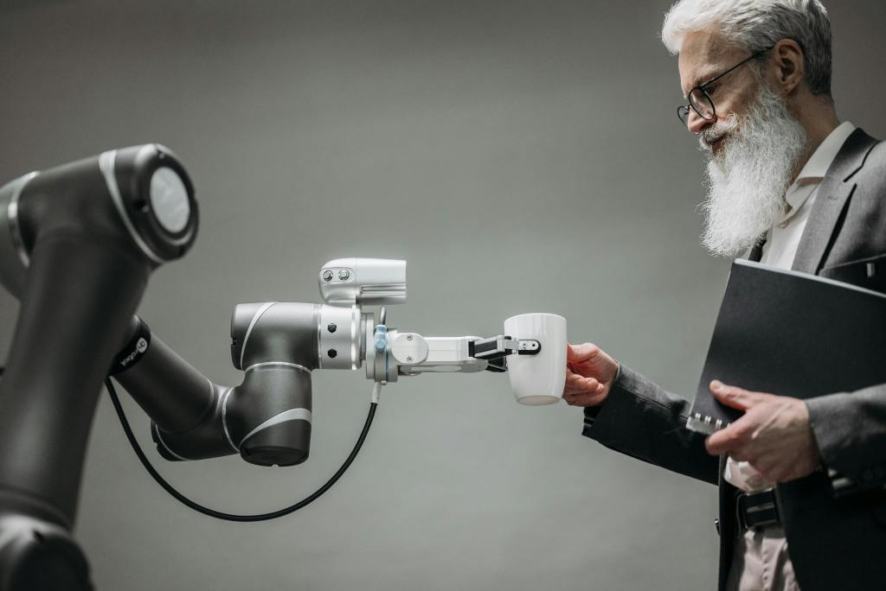
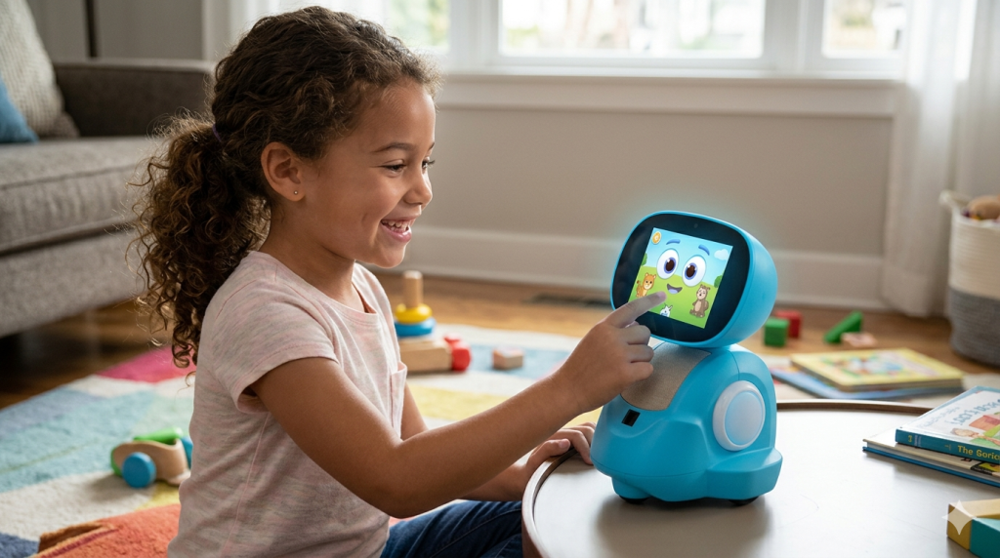
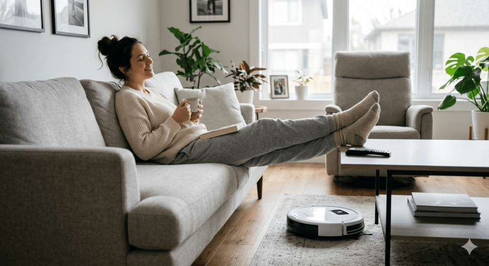
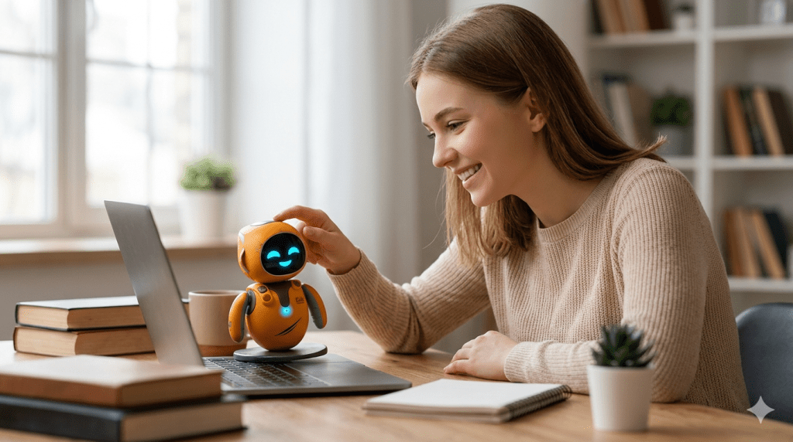
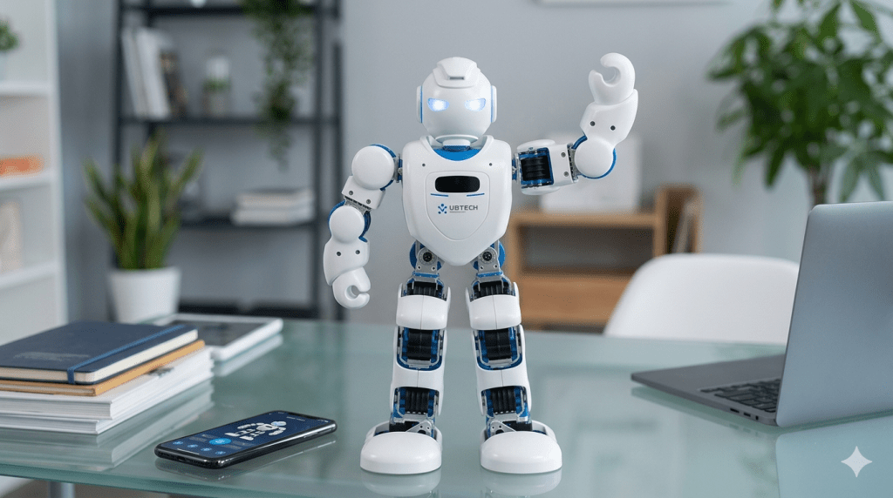
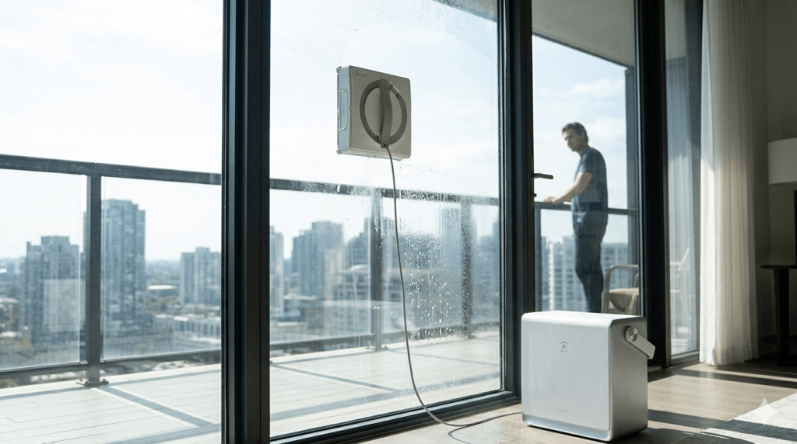

**In 2026, robots are changing how we embrace everyday life. With the rise in artificial intelligence (AI), everyday tasks like drafting emails and meal planning are becoming automated. The development of AI-powered robots is swinging the pendulum towards automation at work and home.**

In India, industrial robots have been around since the late 2000s. They were used predominantly in the automotive manufacturing, electronics, and warehousing sectors. In 2020, the introduction of consumer robots into the Indian market sparked great demand for domestic robots.

In 2024, the Indian consumer robotics market acquired [$580 million in revenue and is expected to rise to $2,742 million by 2030](https://www.grandviewresearch.com/horizon/outlook/consumer-robotics-market/india). 

<!-- truncate -->

Advancements in robotics have enabled robots to do more than pre-programmed tasks. Consumer robots are designed to aid in various ways, including cleaning, companionship, entertainment, and education.

Below are 5 smart robots that have taken the Indian market by storm in 2026.

1. Miko
2. Eureka Forbes
3. Eilik
4. Alpha 1E
5. Winbot

## **Miko: Educational robot and companion**  

[Miko](https://miko.ai) is one of the most influential robotics products in the children's education market. Miko launched in 2017, establishing itself as India's first companion robot for children.

The Miko companion robot is designed to interact, educate, and provide companionship for children.

#### **Key Features and Benefits**

**Safety:** Miko robots are built with rounded edges, non-toxic materials, an impact-resistant body, and sensors for obstacle detection to ensure safety for children.

**Product features:** Miko utilises interactive games, stories, songs, dance, basic conversation, and learning apps to provide entertainment, companionship, and basic education for children.

**Multilingual Support:** Miko robots retain broader language and content portfolios to reach diverse audiences. Miko supports English, Spanish (Europe), Spanish (Latin America), French, German, Italian, Arabic, Chinese, and Hindi.

For parents with busy schedules, Miko is a convenient and safe way to entertain, tutor, and provide companionship for children.

## **Eureka Forbes: SmartClean Robotic Vacuum Cleaner**

[Eureka Forbes](https://www.eurekaforbes.com/), India's reputed home-appliance brand, helped normalise home-cleaning robotic products in the Indian market.

Their [SmartClean](https://www.eurekaforbes.com/c/vacuum-cleaners) vacuums are easy to use and designed to keep homes spotless.

#### **Key Features and Benefits**

**User-friendly:** The SmartClean vacuum cleaner can be controlled using a mobile app, making it convenient to schedule cleaning zones. Some models also have voice command features.

**Surface compatibility:** The robotic vacuum cleaner is designed to accommodate surfaces commonly used in Indian homes, including tile, wood, marble, carpet, or rug.

**Product features:** The SmartClean robot combines vacuuming, mopping, auto-dustbin and smart navigation to provide a complete automated cleaning experience.

For medium-to-large home residents, Eureka Forbes' SmartClean vacuum cleaner is an easy-to-use automated cleaning solution.

Busy professionals can easily schedule cleaning via the mobile app and get on with their daily activities.

## **Eilik: Emotionally Intelligent Companion Robot**

Inspired by robots seen in movies, [Energize Lab](https://store.energizelab.com/collections) invented Eilik. The robot mimics the appearance of R2-D2 from Star Wars and WALL-E.

Eilik is an emotionally intelligent robot designed for companionship, entertainment, and emotional interaction.

This product is catered towards hobbyists or those who enjoy having a friendly gadget on their desks, shelves, or study table.

#### **Key Features and Benefits**

**Interactivity:** Eilik possesses various sensors allowing it to react to touch (head, belly, and back). The companion robot has over 140 different emotions programmed, allowing users to uncover new animations.

**Companionship:** Eilik possesses mini-game features like dancing to music, feeding simulations, and other playful behaviours to entertain users.

**Setup:** Setting up the Eilik robot is fairly straightforward. Unlike the SmartClean vacuum cleaner, users do not require a mobile app — simply charge and use.

Eilik is small in size, allowing users to carry it around and place it wherever they prefer. Its touch-based reactions, mini-games, and animations make it a pleasant desk companion.

In an age where AI is constantly used for companionship, Eilik is the perfect portable companion for enthusiasts to bring to work.

The companion robot can also be customised using various [accessories](https://store.energizelab.com/collections) to suit user preferences.

## **Alpha 1E: Educational and Home Hub Robot**

[Ubtech Robotics](https://www.ubtrobot.com/en/) has developed various humanoid robots capable of window cleaning, massaging, swimming pool cleaning, and lawn mowing.

Ubtech's Alpha 1E robot has reached a large audience in the Indian market through the efforts of India's reputable distributor, [Milagrow Humantech](https://www.milagrowhumantech.com).

Alpha 1E is a humanoid robot designed for education, home use, entertainment, interaction, and experimentation.

Similar to Eilik, Alpha 1E caters to robot enthusiasts and hobbyists who want a glimpse of what robots could evolve to.

#### **Key Features and Benefits**

**Interactivity:** Alpha 1E possesses 16 servo motors, allowing it to mimic human movement (dancing, yoga, push-ups, etc.). The humanoid robot also responds to voice commands and is capable of basic conversation.

**User friendly:** Users can use a PC/mobile app for wireless control. Alpha 1E is compatible with general operating systems (Android, iOS, Windows and MacOS).

**Customisation:** Alpha 1E comes with pre-programmed motions like yoga or dance gestures. However, users can also customise the robot's programming and create new sequences and additional gestures.

For robot enthusiasts or hobbyists, the humanoid robot can serve an educational purpose through experimentation and customisation.

For children, the robot can serve as both a companion and a tutor. Voice interaction and dance moves provide entertainment, while coding lessons can be used for learning.

Through AI-generated commands and new gestures, users can glimpse into the future of robotics.

## **Winbot W2 Pro Omni: Window Cleaning Robot**

The Winbot W2 Pro Omni is a window-cleaning robot designed by [Ecovacs](https://www.ecovacs.com/global). The robot can be used to clean various glass surfaces, including windows, glass doors, mirrors, and other glass surfaces.

#### **Key Features and Benefits**

**User friendly:** The Winbot can be configured via a mobile app. There are various cleaning modes (fast / deep / edge / zone / spot / heavy), allowing residents to customise cleaning based on glass size and dirt level.

**Surface compatibility:** Winbot W2 Pro Omni is compatible with various glass surfaces, including sliding-door balconies or floor-to-ceiling glass. The robot can also be used in high-rise buildings.

**Product features:** The Winbot comes with various built-in sensors, allowing it to navigate different surfaces. Ecovacs included suction, spray and a mop in the Winbot's design to ensure consistent and thorough cleaning.

For high-rise building residents and business owners, Winbot W2 Pro Omni can provide seamless automated cleaning in just a few clicks.

## **Final Thoughts**

In 2026, there is a rise in AI-powered robots used in everyday life. Various tech and robotics companies in India have taken the first step in providing robotic solutions.

These consumer-friendly robots serve various purposes such as cleaning, companionship, tutoring, entertainment and education.

This article highlights the 5 robots that have taken the Indian market by storm. As AI continues to improve, the capabilities of robots will also improve. The robots in this article provide a glimpse into what the future of robots will look like and the type of functionality we can expect.

## **Written by Sam Fernandes**

***Author Bio:*** Sam Fernandes is a freelance content writer and strategist specializing in emerging technology, SaaS, and deep tech trends. You can find more of his work or connect with him via his portfolio at https://sam-fernandes.com/ or on https://www.linkedin.com/in/samuel-fernandes-2a3944170/.

[View more work](https://sam-fernandes.com/)
